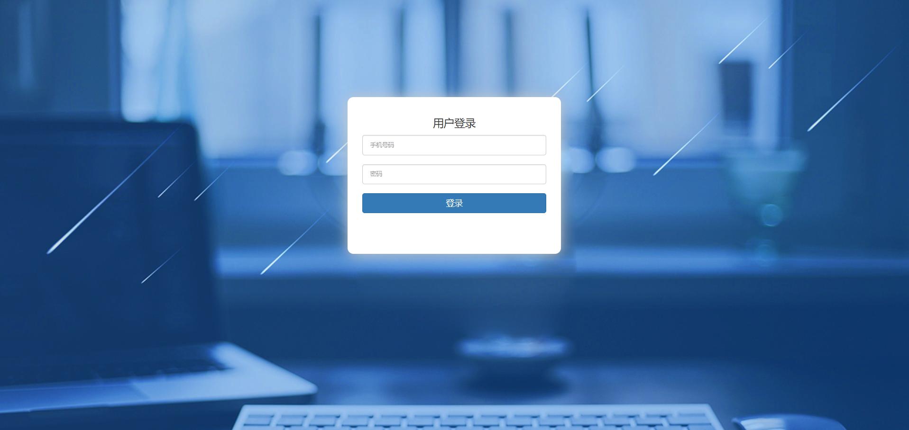
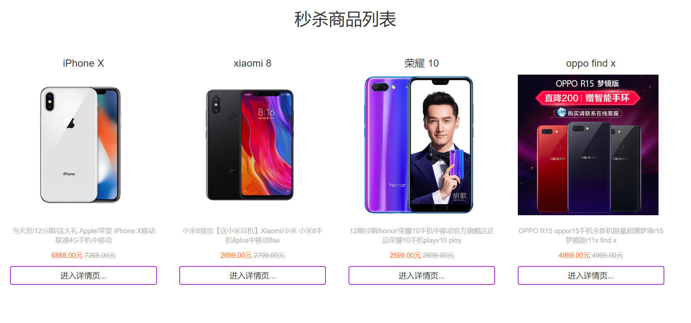

## Seckill System based on Spring Boot, MyBatis, Redis, and RabbitMQ.

## Project Introduction
Developed based on Spring Cloud, Spring Cloud Alibaba, Spring Boot, and Vue3, this system is designed in a multi-tenant SaaS mode. It features a robust user center where one account can have multiple business identities. The system implements RBAC-based permission management and supports blue-green deployment, gateway dynamic routing, service governance (traffic control, circuit breaking, degradation, adaptive protection, service authentication), and other functionalities.

## Project Initiation Instructions

1. Before starting, please configure the addresses for Redis, MySQL, and RabbitMQ in the application.properties file. Make sure to create the required queue named "seckill.queue" in RabbitMQ beforehand.

2. Login address: http://localhost:8888/page/login   

3. URL for the seckill product list: http://localhost:8888/goods/list

## Other instructions

1. There are approximately one thousand users in the database (phone numbers ranging from 18077200000 to 18077200998, with the password set as "123456"). These users are prepared for performance testing. The UserUtil.java class in the cn.hfbin.seckill.util package is used to generate these users, including generating tokens for performance testing purposes.

2. The project has been optimized as follows:

* Page caching, static generation of product details, and static generation of orders (interested parties can consider static generation for all pages).
* Integration of RabbitMQ message queue for optimizing the seckill interface.
* Hiding the seckill interface address
* Implementing interface rate limiting and anti-brute force measures.
* Resolving the overselling issue. 

### screenshot of pages
Login Page

Product List Detail Page

Product Detail Page

Order Detail Page

